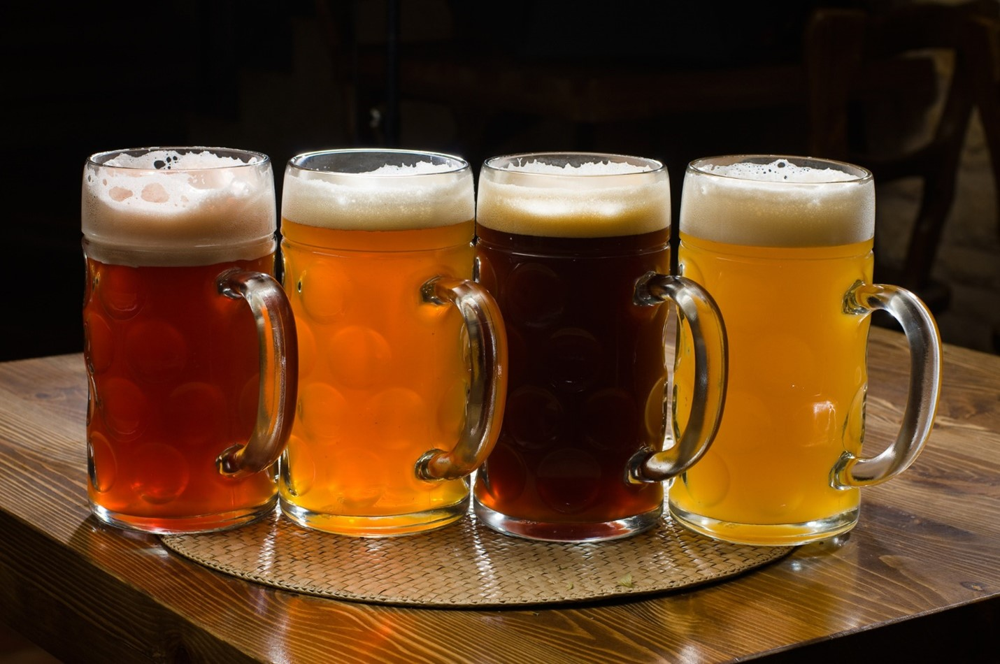

Beer Preference Prediction System
Beer outlets to strategically position themselves and maximize market share in the booming global beer market, understanding customer preferences is crucial. This project leverages advanced data analytics and Natural Language Processing (NLP) techniques to predict beer preferences based on review text. The goal is to provide an automatic rating system and drive insights that can help beer outlets refine their inventory selection and improve customer satisfaction.
 

1. Data
The dataset used in this project comprises detailed customer reviews and ratings from a variety of beers. 
Source: StrataScratch - Beer Data Analysis
2. Method
There are several key methods and models used in this project:
1.	Text preprocessing: The review text was cleaned and preprocessed using techniques such as tokenization, stop words removal, and lemmatization. These steps were crucial to reduce noise and improve the quality of the data for model training.
2.	Sentiment Analysis: A model predicted the sentiment of each review, aiding in understanding customer opinions.

3. Data Cleaning
Data Cleaning Report
In this project, missing values in and review_text  were imputed with 'Unknown' to maintain data integrity and ensure a consistent dataset. To maintain data integrity and ensure a consistent dataset, we replaced outliers in the ABV values with the median ABV. This approach preserved the overall distribution and prevented distortion from extreme values.
•	Problem 1: Inconsistent data entries were common in user-generated content, particularly with beer styles and names.
o	Solution: Standardization and normalization techniques applied to ensure consistency across the dataset.
•	Problem 2: The review text contained a significant amount of noise, including irrelevant words and variations in word forms.
o	Solution: Advanced NLP techniques applied to clean and preprocess the text, improving its suitability for modeling.
EDA 
Exploratory Data Analysis (EDA) revealed key trends and patterns in the data. For instance, the distribution of review scores highlighted that most customers rate beers positively, with few low scores. Model training took into consideration this typical skew with the use of weighted parameters.
 
This shows the key themes that highlight common topics in reviews, such as beer characteristics like "head hop" and "taste malt." Bigrams guide the creation of features for models and enhance sentiment analysis performance. Bigrams are a good sign when working with TFID which considers more common words that might be irrelevant. Correlating bigrams with sentiments to build more accurate models.
5. Algorithms & Machine Learning
Sentiment Analysis with TextBlob
In this section, the analysis involved using sentiment analysis on beer reviews to classify them as positive or negative based on their textual content. We used the Textblob library, which is a simple but accurate tool for processing textual data. The key steps in this process are:
Sentiment Analysis Using TextBlob: TextBlob analyzes each review text to determine its sentiment polarity, ranging from 0 (showing a negative sentiment) or 1 (showing a positive sentiment). Based on the polarity score, reviews are classified as 'positive' or 'negative'. Then, the system records this classification in a new column named 'sentiment' within the DataFrame. The project primarily uses a Support Vector Machine (SVM) for predicting beer preferences. Chosen to its computational efficiency in binary classification tasks, the SVM provides a robust alternative to more resource-intensive deep learning models, achieving comparable accuracy in sentiment prediction.

6. Model Selection
After evaluating various models, the TF-IDF and LinearSVC combination, using the SVM framework, proved effective for handling high-dimensional data. TF-IDF facilitates this by transforming text into a high-dimensional vector space via its vectorizations process. This makes SVM an ideal choice because of its efficiency and accuracy in high-dimensional settings. Adjustments to the model's class weight and the C for regularization parameter to enhance its capability to more accurately interpret textual data and sentiments.

  

Why Use This Pipeline?
TF-IDF Vectorization:
The TfidfVectorizer transforms text data into a numerical matrix where each value reflects the importance of a word within a document relative to the entire corpus. This helps the model prioritize words that are more indicative of sentiment—whether positive or negative—while downplaying common words that contribute less to sentiment differentiation. By setting max_features=10000, you limit the model to the 10,000 most significant words, reducing noise and improving efficiency. Parameters like min_df=5 and max_df=0.7 ensure that only words appearing in at least 5 documents, but not in over 70% of them, are considered. This further refines the features, focusing on those most relevant to sentiment classification.
Linear SVM Classifier:
The aim of the SVM algorithm is to find a plane that has the maximum margin, i.e., the maximum distance between data points of both classes. The LinearSVC classifier is well-suited for binary classification tasks, such as distinguishing between positive and negative reviews. It learns to separate the reviews into two categories based on the TF-IDF features. Including class_weight=class_weight_dict in the pipeline is crucial for handling class imbalance, which often occurs in datasets where one sentiment (e.g., positive reviews) is more prevalent than the other. By assigning higher weights to the minority class, the SVM ensures that the model places more emphasis on correctly predicting this less frequent class, thus reducing bias towards the majority class.
Benefits of This Approach
Accurate Sentiment Classification:
Reviews often contain a mix of positive and negative language, and simple models might overlook subtle indicators of sentiment. The combination of TF-IDF and Linear SVM allows the model to concentrate on what is most critical for determining sentiment, resulting in more accurate predictions of whether a review is positive or negative.
Handling Class Imbalance:
In many real-world datasets, like those in sentiment analysis, there's often a skew towards positive reviews, leading to more data for one class over another. This imbalance can cause a model that predominantly predicts the more frequent class, in this case, positive reviews. By applying a class_weight dictionary {0: 8.282682745389765, 1: 0.5321225993887638}, the model adjusts to allocate more significance to the underrepresented class, enhancing its performance on negative reviews. The Linear SVM is not only computationally efficient but also achieves accuracy comparable to that of a CNN, making it a practical choice for large-scale text analysis. 

7. Predictions
Final Predictions Notebook
Users can input a review text, and the model will predict the likely overall rating and beer style, offering valuable insights into customer preferences.
8. Future Improvements
•	Hybrid Models: Explore hybrid models that combine content-based and collaborative filtering techniques to enhance prediction accuracy.
•	Real-time Deployment: Deploy the model in a real-time application to provide instant predictions based on new reviews.
•	Expanded Feature Set: Incorporate additional features such as user demographics or purchase history to improve prediction accuracy.

